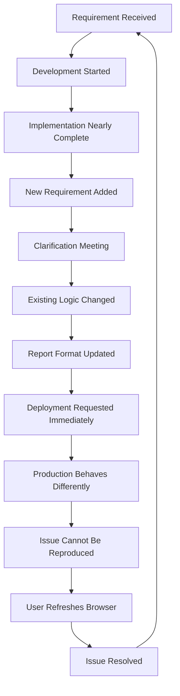

# Shyam Basnet   

### Backend Engineer · Maintenance Department

  
  
  


---

## Current Operating Mode

```txt
Wake up.
Open laptop.
Resolve yesterday's deployment issue.
Attend meeting about new requirement.
Update existing API.
Add one more column.
Update Excel export.
Fix environment variable.
Attend clarification meeting.
Deploy.
Receive message: "Small change only."
Repeat.
```

---

## About Me

```yaml
name: Shyam Basnet
role: Backend Engineer
location: Bhutan

specialization:
  - backend systems
  - APIs
  - databases
  - Docker
  - Kubernetes
  - distributed debugging
  - explaining why a small change is not small

currently_learning:
  - Rust
  - deeper system design
  - AI-assisted workflows
  - how to preserve curiosity while maintaining enterprise software

current_objective:
  - build something genuinely interesting before another urgent report arrives

status:
  - available after the meeting
```

---

## Technology Stack

|Technology|Intended Purpose|Actual Purpose|
|---|---|---|
|NestJS|Building scalable backend services|Adding another endpoint with the same business logic|
|PostgreSQL|Reliable data storage|Supplying data for another Excel export|
|MySQL|Structured relational data|Discovering tables nobody remembers creating|
|Redis|Fast caching|Disconnecting at the least convenient moment|
|Docker|Reproducible environments|Proving that environments are not reproducible|
|Kubernetes|Container orchestration|Asking which kubeconfig is currently active|
|GitHub Actions|Automated deployment|Failing because of one invisible YAML detail|
|Rust|Systems programming|Experiencing compiler errors that are at least honest|
|ExcelJS|Spreadsheet generation|The actual backbone of enterprise civilization|

---

## Workload Distribution

```txt
Actual engineering                    [████░░░░░░]  38%
Fixing configuration                  [██████░░░░]  61%
Reports and exports                   [███████░░░]  74%
Meetings about requirements           [████████░░]  82%
Receiving finalized requirements      [░░░░░░░░░░]   0%
Remembering which service owns logic  [███░░░░░░░]  31%
Pretending this is a small change     [██████████] 100%
```

---

## Typical Feature Lifecycle



---

## Weekly Highlights

```log
[MONDAY]    Fixed issue caused by missing environment variable
[TUESDAY]   Fixed different issue caused by same environment variable
[WEDNESDAY] Added one more filter to existing report
[THURSDAY]  Changed report because filter requirements changed
[FRIDAY]    Joined meeting to discuss why feature is taking time
[SATURDAY]  Thought briefly about learning Rust
[SUNDAY]    Received message: "Just one quick check"
```

---

## Repeated Activities Registry

|Activity|Frequency|Emotional Impact|
|---|---|---|
|Add another filter|Daily|Manageable|
|Update Excel columns|Frequently|Slowly accumulating|
|Rename field across services|Unexpectedly often|Significant|
|Check why API is slow|Without endpoint details|Severe|
|Compare staging and production|Ritualistically|Normalized|
|Restart container|Optimistically|Temporary relief|
|Explain database migration|Repeatedly|Character building|
|Attend meeting about previous meeting|Recurring|Beyond measurement|
|Receive screenshot as requirement|Predictably|Accepted fate|

---

## Current Sprint

-  Add field
    
-  Remove field
    
-  Add field again with different name
    
-  Update validation
    
-  Update database migration
    
-  Update API response
    
-  Update Excel export
    
-  Explain why deployment is required
    
-  Deploy immediately
    
-  Revert immediately
    
-  Receive stable requirements
    
-  Build something innovative
    
-  Finish one task without context switching
    
-  Leave work without checking logs one final time
    

---

## Production Support Simulator

```bash
$ describe_problem

User: "It is not working."

$ ask_for_error_message

User: "Nothing happens."

$ ask_for_steps_to_reproduce

User: "It was working yesterday."

$ request_screenshot

User: "Please check from your side."

$ check_logs

No relevant errors found.

$ request_screen_share

User: "Now it is working."

$ close_issue

Reason: Unknown
Resolution: Refresh
Confidence: Temporary
```

---

## Small Change Estimator

|Request|Estimated Scope|Actual Scope|
|---|---|---|
|Change label text|One frontend file|Three services, one migration, two deployments|
|Add one column|Report update|API, query, DTO, export, UI, approval|
|Make it dynamic|Undefined|Everything|
|Fix login issue|Authentication check|Clock drift, session expiry, environment config|
|Add Excel export|Utility function|New reporting module|
|Update dropdown|Simple list|New database table and admin management page|
|Rename status|Text replacement|Historical data migration and compatibility logic|

---

## Things I Enjoy Building

```txt
✓ backend systems with clear boundaries
✓ maintainable APIs
✓ thoughtful database design
✓ automation that removes repetitive work
✓ useful AI-assisted workflows
✓ tools that solve actual problems
✓ systems that do not require the same manual task every week
```

## Things Currently in the Backlog

```txt
- meaningful innovation
- deeper architecture work
- reducing technical debt
- improving developer experience
- uninterrupted focus time
- receiving requirements before the deadline
```

---

## Frequently Asked Questions

Yes.

Please attach the updated database schema, API contract, revised report format, approval note, deployment window, and the actual definition of “small.”

Historical reasons.

The history is classified.

Yes.

It will require a configuration table, management API, validation layer, admin interface, permission mapping, deployment, documentation, and another meeting.

Production has developed a personality.

Because compiler errors are refreshingly specific.

Yes.

It has been temporarily paused to add one more column to a report.

---

## GitHub Activity

---

## Personal Roadmap

|Goal|Status|
|---|---|
|Improve backend architecture skills|In progress|
|Learn Rust deeply|In progress|
|Build useful AI assistants|In progress|
|Automate repetitive workflows|Urgently required|
|Escape endless CRUD maintenance|Pending approval|
|Protect uninterrupted thinking time|Blocked by calendar|
|Work on meaningful innovation|Moved to next sprint|
|Receive final requirements|Awaiting stakeholder confirmation|

---

## Contact

[](mailto:shyambasnet289@gmail.com)

[](https://github.com/Shyam576)

---

## Build Status: Successful

### Minor updates required.

### Please revise and resubmit.


